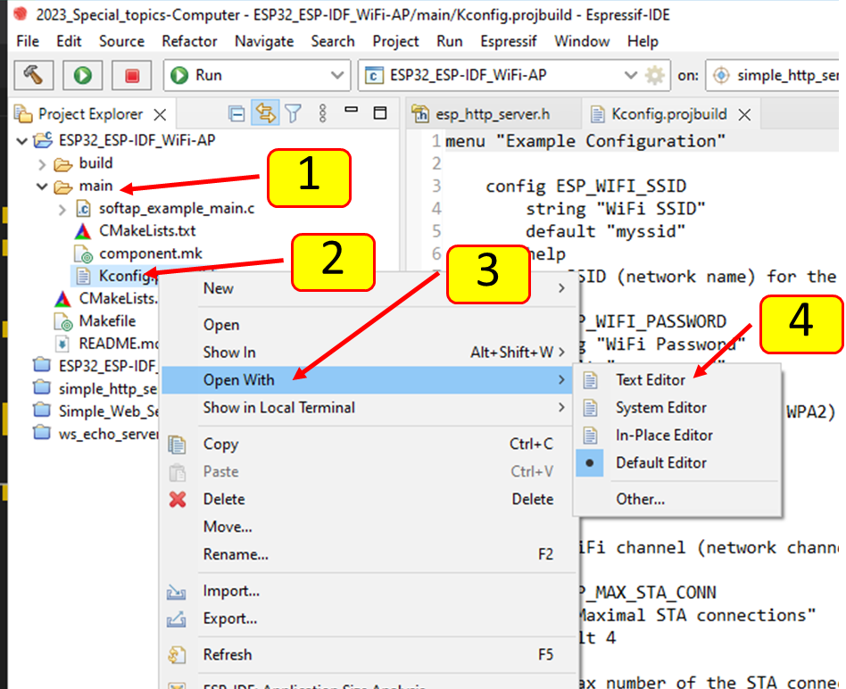
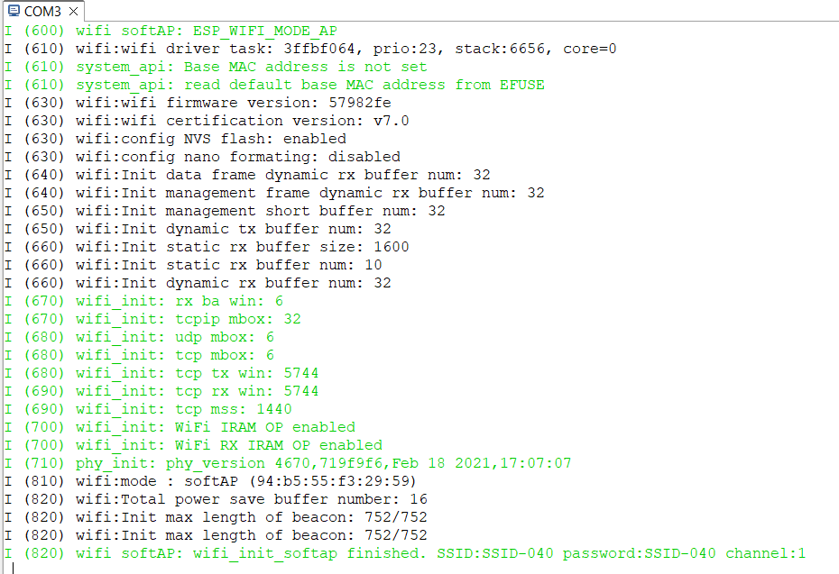
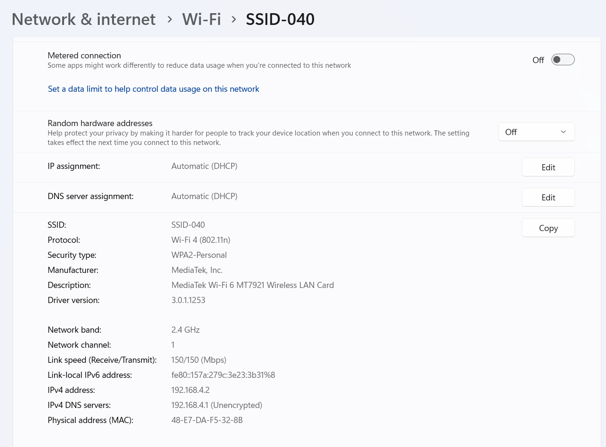

# ใบงานการทดลอง ESP32_ESP-IDF_WiFi-AP

## ขั้นตอนการทดลอง

1. สร้าง Espressif IDF project ใหม่ ชื่อ  ESP32_ESP-IDF_WiFi-AP 

1.1  หลังจากใส่ชื่อ คลิก next เพื่อเลือก template project

1.2 เลือก template project เป็น softAP

### 2. แก้ไขไฟล์ config

2.1 เปิดไฟล์ Kconfig.projbuild  ในโฟลเดอร์ main ด้วย text editor

[1] เปิด folder  main
 
[2] คลิกขวาที่ชื่อไฟล์ Kconfig.projbuild

[3] เลือก Open With
 
[4] เลือก Text Editor

2.2 แก้ไขไฟล์

 

[1] แก้ไข SSID  ให้มีความแตกต่างจากของเพื่อน โดยใส่เลข 3 ตัวท้ายของรหัสนักศึกษากำกับไว้ เช่น `"SSID-001"` เป็นต้น

[2]  อาจจะแก้ password ตามต้องการ

หมายเหตุ ไฟล์นี้สามารถแก้ได้ภายหลังจากการเรียก  sdkconfig

### 3. Build โปรเจค

### 4. Run โปรเจค ดูผลจาก Terminal

### 5. ใช้ Laptop หรือ Smartphone ค้นหา Accesspoint 

ควรจะต้องเจอ `"SSID-..."` ในรายการ Wifi ที่เราสร้างขึ้น

### 6. บันทึกผลการทดลอง 

ทั้งที่หน้าจอ Laptop หรือ Smartphone และที่ terminal ของ ESP32

รวมทั้งหน้าจอ properties ของ wifi ดังตัวอย่าง

### 7. ส่งงาน

โดยการ pull request พร้อมแนบ link ไปยัง Repository ของโปรเจคมาด้วย

## Link Repository
https://github.com/CHOTIKA040/ESP32_ESP-IDF_WiFi-AP-