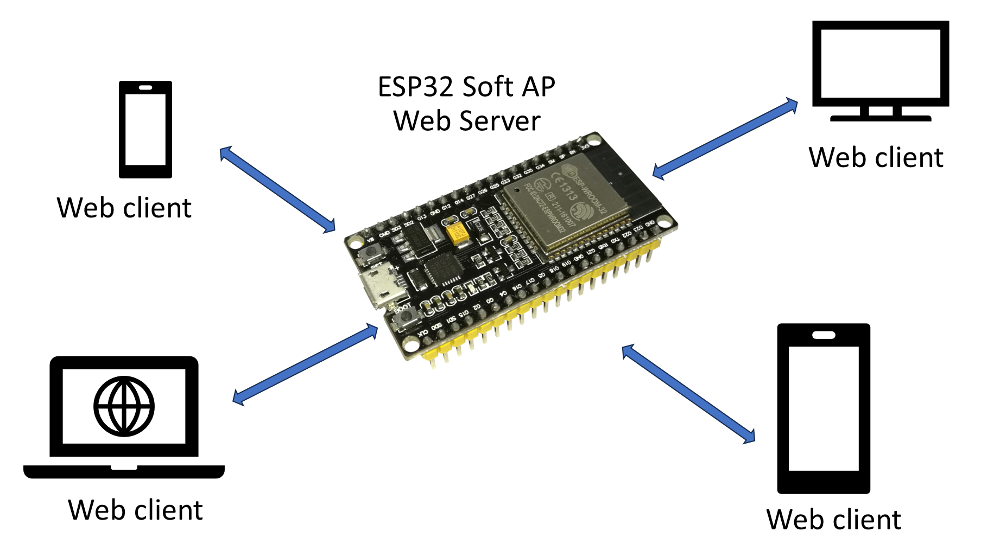

# ใบงานการสร้าง Wi-Fi Access Point (AP) ด้วย ESP-IDF

ในใบงานนี้ เราจะเรียนรู้การสร้าง Wi-Fi Access Point (AP) ด้วย ESP-IDF ซึ่งบอร์ด ESP32 ที่ใช้ในการทดลองมีความสามารถทั้งการเชื่อมต่อ WiFi ในฐานะอุปกรณ์ (station) และจุดกระจายสัญญาณ WiFi (Access point) 

## Access Point (AP) Introduction
Soft-Access point หรือ AP mode ของ ESP32 หมายถึง  “software-enabled access point.”  ที่ทำหน้าที่คล้าย ๆ  ‘virtual router,’
ที่ถูกสร้างจาก software ทำให้บอร์ด ESP32 ทำหน้าที่เป็น wireless access point

เมื่อ ESP32 ทำหน้าที่เป็น Soft-Access point มันจพสามารถสร้างเครื่อข่าย Wi-Fi ของตัวเอง และทำหน้าที่เป็น hot spot ให้ ESP32 ตัวอื่นหรือแม้กระทั่งคอมพิวเตอร์หรือ smartphone ได้





## ESP32 Wi-Fi ESP-IDF APIs

### 1. Include header file เพื่อใช้ ESP Wi-Fi Library

```c
#include "esp_wifi.h"
```

### 2. การตั้งค่า (Configuration)

เราต้องจัดารรพรัพยากรที่จำเป็นให้แก่ Wi-Fi driver โดยการส่งผ่านทาง โครงสร้างข้อมูล wifi_init_config_t โดยฟังก์ชัน

```c
esp_wifi_init(const wifi_init_config_t *config);

```
ถ้าต้องการความรวดเร็ว เราอาจจะกำหนดค่าเริ่มต้นให้แก่ wifi_init_config_t ตามค่าเริ่มต้นที่ framework เตรียมไว้ให้ ซึ่งสามารถทำได้โดยฟังก์ชันนี้

```c
wifi_init_config_t wifi_config = WIFI_INIT_CONFIG_DEFAULT();

```


###3. กำหนดโหมดการทำงาน

ESP-IDF Wi-Fi library อนุญาตให้เราใช้งาน Wi-Fi บน ESP32 ได้ในหลายโหมดด้วยกัน
โดยเราสามารถกำหนดโหมดได้ด้วยฟังก์ชัน `esp_wifi_set_mode()` โดยโครงสร้างข้อมูลสำหรับโหมดเป็น parameterของฟังก์ชัน

เราสามารถกำหนดโหมดของ ESP32 ได้ทั้งหมด 3 โหมด ได้แก่

a. WIFI_MODE_STA (for station mode)
b. WIFI_MODE_AP (for soft-AP mode)
c. WIFI_MODE_APSTA (for station + soft-AP mode)

รูปแบบคำสั่งการเลือกโหมด

```c
esp_wifi_set_mode(wifi_mode_t mode);


### 4. เริ่มต้น Wi-Fi


การเริ่มต้นการเชื่อมต่อ Wi-Fi ตามที่ตั้ง config และ mode ไว้แล้วนั้น เราสามารถเรียกใช้ตำสั่ง
 `esp_wifi_start()` ได้ทันที โดยมีรูปแบบของคำสั่งคือ 

```c
esp_wifi_start(void)

```

### 5. เชื่อมต่อ ESP32 เข้ากับ access point

หลังจากที่ Wi-Fi เริ่มทำงานแล้ว เราสามารถที่จะเชื่อมต่อเข้ากับ  access point โดยใช้คำสั่งต่อไปนี้

```c
esp_wifi_connect()

```

## [>> ใบงานการทดลอง >> ](./Lab_Sheet_ESP32_ESP-IDF_WiFi-AP.md)

